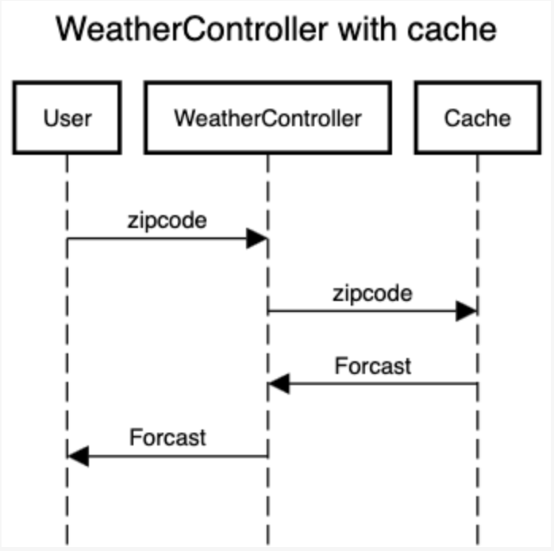
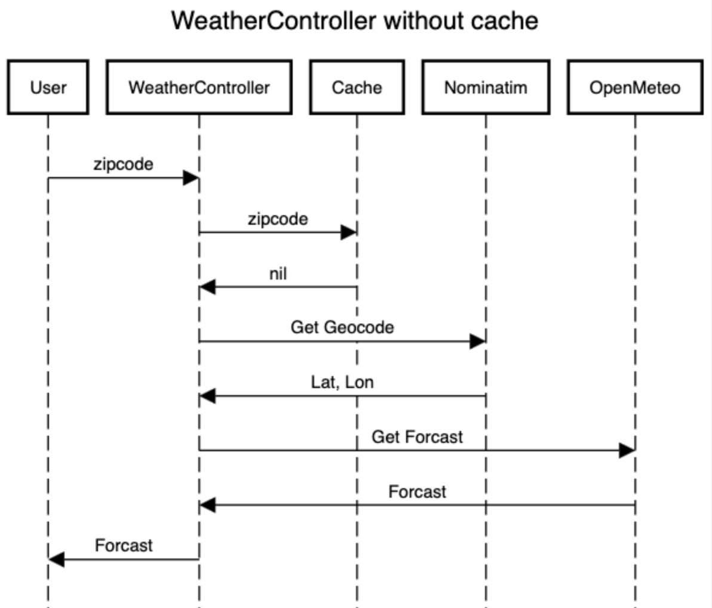

# README

## Setup

1. Follow the ruby and rails setup - https://guides.rubyonrails.org/install_ruby_on_rails.html

2.Ensure the following ruby version

```
$ ruby --version
ruby 3.4.5 (2025-07-16 revision 20cda200d3) +PRISM [x86_64-darwin21]
```

3. Ensure the following rails version

```
$ rails --version
Rails 8.0.2
```

4. Run `bundle install`

5. Run the app with `rails s`

## Run Tests

You can run the tests with `rails test`

## Application architecture

The application uses an MVC architecture but services are fetching data instead of models. We have services to external api's which can be substitued any time as they are decoupled from the controller with an abstract service and DTO. An inmemory cache is used and it uses LRU eviction by default. The apps entry point is HomeController which takes an address(just a zipcode) for now and forwards the request to weather controller. Weather controller architecture is show below. If an error is thrown the user is redirected back to home screen, can be tested by using "error" as zipcode.

## WeatherController architecture



